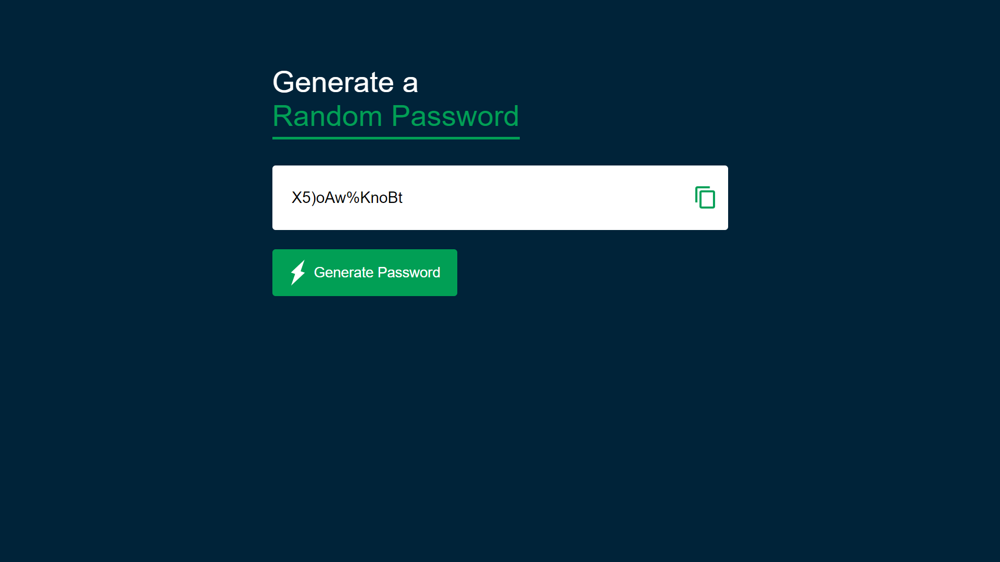

# Random Password Generator

### Project Description:

Built a random password generator using `<HTML>`, `<CSS>`, and `<JavaScript>` that creates strong, unique passwords for users. The generator features a user-friendly interface, customizable password length and complexity, and uses `<JavaScript>` to generate truly random passwords.

### Key Features:

- User-friendly interface built with HTML and CSS
- JavaScript-generated random passwords
- Responsive design for mobile and desktop devices

### Technical Skills Used:

- HTML5
- CSS3
- JavaScript

### Achievements:

- Successfully implemented a client-side random password generator using JavaScript
- Designed a responsive and user-friendly interface using HTML and CSS
- Allowed users to customize password length and complexity to meet their specific needs
